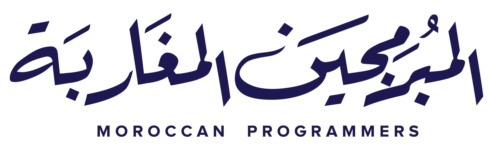
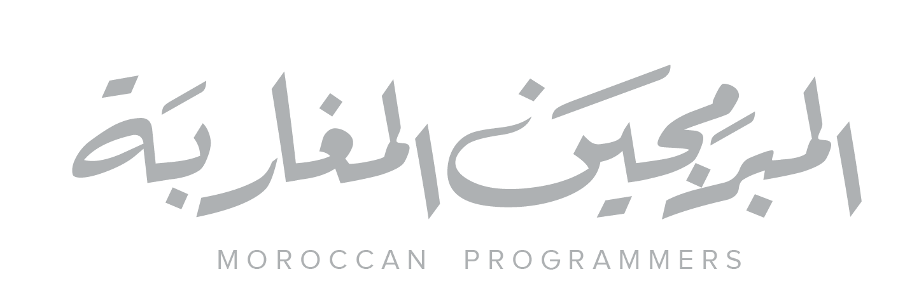

<p align="center"></br></br></br></br>

</p></br></br></br></br>

<a href="https://snyk.io/test/github/moroccanprogrammers/moroccovid-19?targetFile=package.json"></a>
## 01 - About Project

This is a redesign of the past web project, Moroccovid-19, With a large number of rounded corners and white space, users can freely control the relevant columns of the home page for easy operation, users can also get the latest news from trusted sources.

## 02 - Requirements
+ [Nodejs](https://nodejs.org/en/)
+ [npm](https://www.npmjs.com/) or [Yarn](https://yarnpkg.com/)

*Note:* I prefer you to use `Yarn` to run scripts, but you can do any of these commands below with `npm`

## 03 - Usage
### Install dependencies
```sh
yarn install
```
### Run files watching
```sh
yarn watch
```
### Run hot reload
```sh
yarn hot
```
### Build for production
```sh
yarn prod
```
or
```sh
yarn build
```

## 04 - Dark Mode

In order to make it easier to operate at night, a dark mode is created here.


## 05 - How to contribute :

1 - Fork this repository

2 - Clone the repository

```bash
git clone https://github.com/username/moroccovid-19.git
```
3 - Make your changes and commit 
```bash
git commit -m "Made some changes"
```
4 - Send your PR

## 06 - License

Do whatever you want with this project just don't, not for commercial use


<p align="center"></br></br></br></br>

</p>
